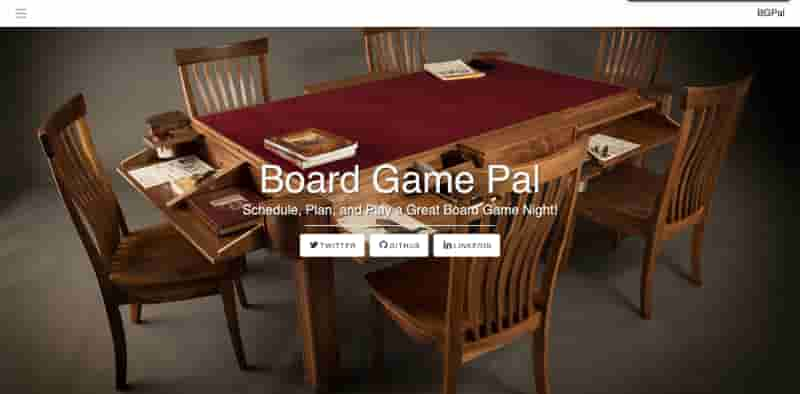
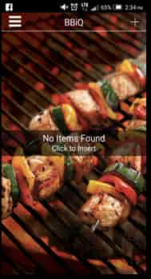

### Zenhub

A better way to manage your GitHub issues. Multi-repo boards, epics, and reports -- all without ever leaving GitHub.

[Demo](https://www.zenhub.com)

### Games Portfolio

A portfolio I threw together a number of years ago to highlight some game development I was part of. I had intended to use the site as my main blog, but never really liked it.

[Demo](https://dennyscott.games.io) | [Github repo](https://github.com/DennyScott/zephyr-lab)

### ESI Rails

A human-resource and customer relationship management software tool for ESI Rails.

[Demo]()

### Customer Connect

Allowing our teams to transform the customer follow-up experience with our enterprise POS platform RQ.

### Board Game Meetup

A simple web app prototype we were using to plan board game nights. Sets event, selects boardgames, sends reminders.

[Github repo](https://github.com/DennyScott/boardgamepal)

### PGA Moisture Analyzer

Moisture analyzer allows farmers to moinitor and update their moisture sensors and machinery through WiFi connectivity

[Demo](https://appadvice.com/app/pga-moisture-meter/1307581961)

### Endless Aisle

An interactive touchscreen that allows your in-store customers to browse and buy a wide variety of virtual merchandise

[Demo](https://www.iqmetrix.com/products/endless-aisle)

### SmartShop Online Store

A buisness-facing ecommerce tool for purchasing and delivering payment terminals and accessories

### Prequel Memes

Ultimate tool to encourage content creation and bring balance to the subreddit of /r/PrequelMemes. I gave help where I could, props go to [Dustin Horrock](dustin.surge.sh) for the majority of work.

[Demo](https://http://www.prequelmemes.com/#/)

### Beeline

improve the route planning process and create a solution to make multiple stops a breeze. I gave help where I could, props go to [Dustin Horrock](dustin.surge.sh) for the majority of work.

### WowVR

Bringing the power and innovation of Canadian Tires Patio VR experience to your mobile phone.

### Catch

A social community for Canadian anglers to share their fishing experiences

### Canadian Tire Retail App

Canadian Tire's flagship app

[Demo](https://www.canadiantire.ca/en/mobile.html)

### Canadian Sports Hall of Fame VR

 An innovative virtual reality experience that doubles as a formal invitation to the opening of the Canadian Sports Hall of Fame.

### Canadas Dream Backyard and Patio Builder

A fully immersive patio and backyard builder, merging 4k touch screens and state-of-the art VR technology.

### Canadas Dream Garage Builder

A fully immersive garage builder, merging 4k touch screens and state-of-the art VR technology.

### Stick

Based on a set of preferences, from simple to advanced, assist customers in purchasing hockey stick at SportCheck.

### osCaddie

A simple way to allow our internal teams at Appnovation to scale and monitor devops and deployment systems.

### BecomeTheGamer

A tool that used statistical analysis to determine the best counter-picks, strategies, and preferences to a Dota 2 game.

[Demo](https://dota2.becomethegamer.com/)

### Convention

A mobile app that allowed Canadian Tire dealers to browse and purchase products from Canadian Tire conventions.

### Fishing Kiosk

A kiosk meant to be used in tandem with Catch, which helped customers purchase product, and locate lakes, based on their desired "catch" goals.

### BBiQ

Make sure everything you are grilling comes off exactly at the same time with this Canadian Tire App.

# Open Source Contributions
--------------------------------------------------------

### Boostnote

An open source markdown editor for Mac, Windows and Linux app.

[Demo](https://boostnote.io/) | [Github repo](https://github.com/BoostIO/Boostnote)

### CodeBuddies

A global community of code learners who help each other through conversations on Slack and peer-to-peer organized study groups and virtual hangouts.

[Demo](https://codebuddies.org/) | [Github repo](https://github.com/codebuddies/codebuddies)

### Mojiscript

An async-first, opinionated, and functional language designed to have 100% compatibility with JavaScript engines.

[Demo](https://mojiscript.js.org/#/) | [Github repo](https://github.com/joelnet/MojiScript)